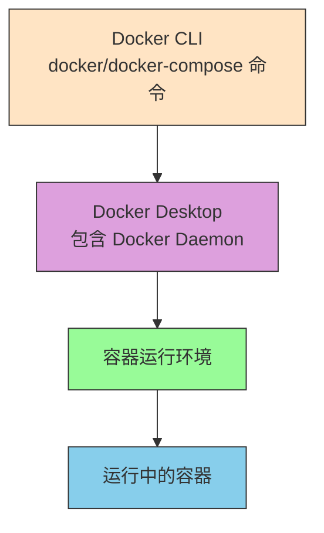
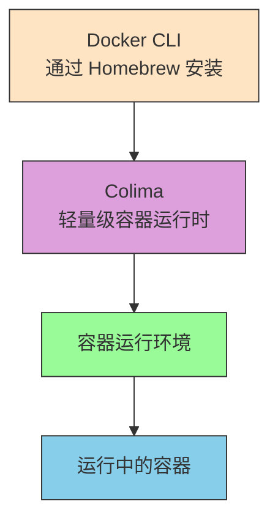

# 容器化架构说明

## Docker Desktop 架构（传统方式）



## Colima 架构（当前使用的方式）



## 架构对比说明

| 组件 | Docker Desktop | Colima |
|------|----------------|---------|
| **资源占用** | 较高（包含 GUI 和额外服务） | 较低（仅核心运行时） |
| **启动速度** | 较慢 | 较快 |
| **系统集成** | 深度集成 macOS | 轻量级集成 |
| **Docker CLI 兼容性** | 完全兼容 | 完全兼容 |
| **Docker Compose 支持** | 原生支持 | 完全支持 |

## 工作原理

在 Colima 环境中：
1. 我们通过 Homebrew 安装了 Docker CLI 工具（`docker` 和 `docker-compose` 命令）
2. 这些 CLI 工具通过 Unix Socket 与 Colima 通信
3. Colima 提供了实际的容器运行环境
4. 所有的 `docker` 和 `docker-compose` 命令都能正常工作，就像在 Docker Desktop 中一样

## 环境变量配置

为了让 Docker CLI 能够正确连接到 Colima，我们需要设置环境变量：

```bash
# 指向 Colima 的 Docker Socket
export DOCKER_HOST=unix:///Users/$(whoami)/.colima/default/docker.sock
```

这样，当我们运行 `docker` 命令时：
- Docker CLI 会通过指定的 Socket 连接到 Colima
- Colima 会处理容器的创建、启动、停止等操作
- 用户体验与使用 Docker Desktop 几乎完全相同

## 优势总结

使用 Colima 替代 Docker Desktop 的优势：
1. **资源节省**：CPU 和内存占用显著降低
2. **启动快速**：Colima 启动速度比 Docker Desktop 快很多
3. **兼容性强**：完全兼容现有的 Docker CLI 和 Docker Compose 命令
4. **轻量级**：不包含不必要的 GUI 和后台服务